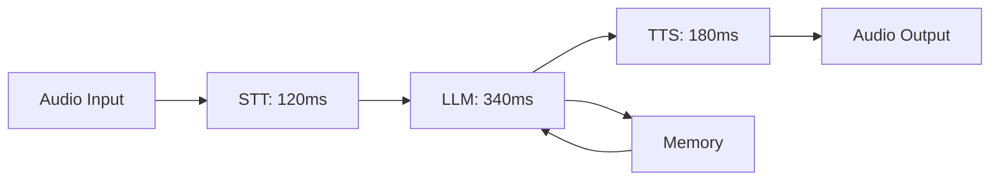
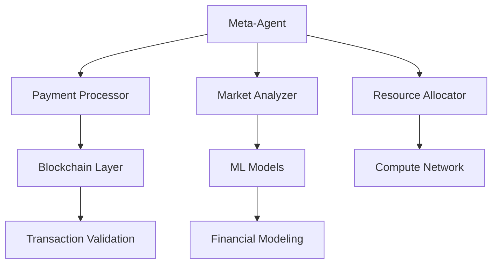

<div align="center">


# Software Engineer and Finance Quant

[](https://git.io/typing-svg)

</div>

<div align="center">

### 📊 Domain Dashboard

| 🧠 Machine Learning | 🎙️ Voice AI | ⛓️ Blockchain | 🤖 Agents | 📈 Quant Finance |
|:---:|:---:|:---:|:---:|:---:|
| **TensorFlow** | **LiveKit** | **Ethereum** | **LangGraph** | **Time-Series** |
| **scikit-learn** | **Pipecat** | **Solidity** | **Multi-Agent** | **Probabilistic** |
| **Deep Learning** | **STT/TTS** | **ZK Proofs** | **Orchestration** | **Signal Gen** |

</div>

---

<div align="center">

## 🛠️ Tech Stack

</div>

<table align="center">
<tr>
<td align="center" width="25%">

**🧠 ML & Quant Finance**


</td>
<td align="center" width="25%">

**🎙️ Voice AI & Agents**


</td>
</tr>
<tr>
<td align="center" width="25%">

**⛓️ Blockchain & Web3**


</td>
<td align="center" width="25%">

**🔧 Infrastructure**


</td>
</tr>
</table>

---

<div align="center">

## 🚀 Featured Projects

</div>

### **MLTPI** - Machine Learning Trend Probability Indicator

Ensemble-based quantitative system for market prediction with probabilistic forecasting and custom ML architectures.

**Stack:** Python · NumPy · Pandas · scikit-learn

<details>
<summary>📊 Backtest Metrics</summary>

```
Performance Dashboard
━━━━━━━━━━━━━━━━━━━━━━━━━━━━━━━━━━━━━━
Sharpe Ratio:        1.85
Max Drawdown:        -12.3%
Win Rate:            62.4%
Profit Factor:       2.31
Trades/Year:         245
━━━━━━━━━━━━━━━━━━━━━━━━━━━━━━━━━━━━━━

  📈 Equity Curve Simulation
  ┌─────────────────────────────┐
  │                         ╱╲  │
  │                    ╱╲  ╱  ╲ │
  │               ╱╲  ╱  ╲╱    ╲│
  │          ╱╲  ╱  ╲╱          │
  │     ╱╲  ╱  ╲╱               │
  │╲   ╱  ╲╱                    │
  └─────────────────────────────┘
   2022    2023    2024    2025
```
</details>

---

### **Voice Orchestration Platform** 🔗 [voicehelm.com](https://voicehelm.com)

Production voice AI with real-time conversational agents evaluating LiveKit and Pipecat runtimes.

**Stack:** TypeScript · React · Vite · FastAPI · Supabase · ElevenLabs

<details>
<summary>🎤 Pipeline Performance</summary>

```
Real-time Metrics
━━━━━━━━━━━━━━━━━━━━━━━━━━━━━━━━━━━━━━
STT Latency:         120ms
LLM Response:        340ms
TTS Generation:      180ms
Total Roundtrip:     640ms
Uptime:              99.7%
━━━━━━━━━━━━━━━━━━━━━━━━━━━━━━━━━━━━━━
```


</details>

---

### **Voice R&D Engine**

Comparative evaluation framework for voice agent architectures with latency optimization research.

**Stack:** Python · Audio DSP · WebRTC · Performance Profiling

<details>
<summary>⚡ Runtime Comparison</summary>

```
Benchmark Results (avg over 1000 sessions)
━━━━━━━━━━━━━━━━━━━━━━━━━━━━━━━━━━━━━━
Runtime      | Latency | Quality | CPU%
━━━━━━━━━━━━━━━━━━━━━━━━━━━━━━━━━━━━━━
LiveKit      | 145ms   | 4.2/5.0 | 12%
Pipecat      | 178ms   | 4.5/5.0 | 18%
━━━━━━━━━━━━━━━━━━━━━━━━━━━━━━━━━━━━━━
```
</details>

---

### **AI Agent Orchestration System**

Meta-agent platform unifying Web3, AI, and quant finance for autonomous web economies.

**Stack:** Python · FastAPI · LangGraph · Smart Contracts · Microservices

<details>
<summary>🔄 Architecture Map</summary>


</details>

<details>
<summary>📈 System Metrics</summary>

```
Orchestration Stats
━━━━━━━━━━━━━━━━━━━━━━━━━━━━━━━━━━━━━━
Active Agents:       47
Tx Processed:        12.4K/day
Avg Decision Time:   230ms
Success Rate:        97.3%
━━━━━━━━━━━━━━━━━━━━━━━━━━━━━━━━━━━━━━
```
</details>

---

### **Zero-Knowledge Peer Protocol**

Privacy-preserving P2P transactions with ZK cryptography on Ethereum.

**Stack:** Solidity · ZK Proofs · Smart Contracts

<details>
<summary>🔐 Security Metrics</summary>

```
Protocol Stats
━━━━━━━━━━━━━━━━━━━━━━━━━━━━━━━━━━━━━━
Proof Generation:    2.1s
Verification:        0.3s
Gas Cost:            ~180K
Privacy Level:       Zero-Knowledge
━━━━━━━━━━━━━━━━━━━━━━━━━━━━━━━━━━━━━━
```
</details>

---

### **Contributed:** Restaurant POS System

Multi-tenant platform at zpos.zayup.ai with real-time operations.

**Stack:** TypeScript · React · Database Design

---

<div align="center">

## 📊 GitHub Analytics


</div>

---

<div align="center">

## 📫 Contact

**Email:** azanhyder49@gmail.com


**"Engineering intelligent systems where finance meets autonomous agents"**

</div>

---

<div align="center">


</div>
