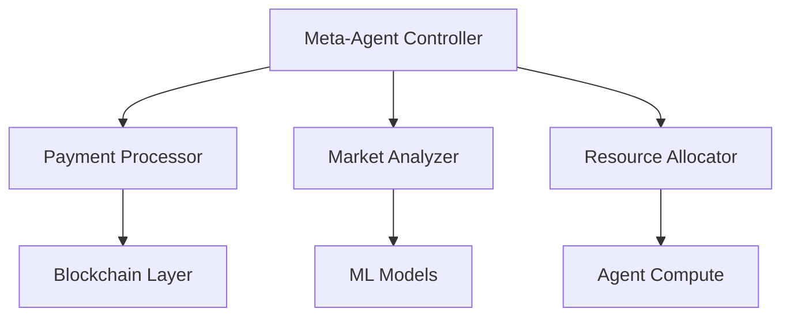

<div align="center">

# Software Engineer and Finance Quant

[](https://git.io/typing-svg)

</div>

<div align="center">

### 📊 Domain Dashboard

| 🧠 Machine Learning | 🎙️ Voice AI | ⛓️ Blockchain | 🤖 Agents | 📈 Quant Finance |
|:---:|:---:|:---:|:---:|:---:|
| **TensorFlow** | **LiveKit** | **Ethereum** | **LangGraph** | **Time-Series** |
| **scikit-learn** | **Pipecat** | **Solidity** | **Multi-Agent** | **Probabilistic** |
| **Deep Learning** | **STT/TTS** | **ZK Proofs** | **Orchestration** | **Signal Gen** |

</div>

---

<div align="center">

## 🚀 Featured Projects

</div>

### 📈 **MLTPI** - Machine Learning Trend Probability Indicator

<div align="center">

</div>

Advanced quantitative system using ensemble methods, time-series forecasting, and probabilistic models for market prediction. Custom feature engineering with volatility modeling and backtesting frameworks.

**Stack:** Python · NumPy · Pandas · scikit-learn

<details>
<summary>📊 View Sample Backtest Performance</summary>

```
Strategy Performance Metrics:
━━━━━━━━━━━━━━━━━━━━━━━━━━━━━━━━━━━━━━━━
📈 Sharpe Ratio:        1.85
💰 Max Drawdown:        -12.3%
🎯 Win Rate:            62.4%
⚡ Trades/Year:         245
━━━━━━━━━━━━━━━━━━━━━━━━━━━━━━━━━━━━━━━━
```
</details>

<div align="center">

**━━━━━━━━━━━━━━━━━━━━━━━━━━━━━━━━━━━━━━━━━━━━━━━━━━━**

</div>

### 🎙️ **Voice Orchestration Platform** 🔗 [voicehelm.com](https://voicehelm.com)

<div align="center">

</div>

Enterprise voice AI with real-time conversational agents. Evaluates LiveKit and Pipecat for low-latency streaming with multi-modal integration and adaptive response generation.

**Stack:** TypeScript · React · Vite · FastAPI · Supabase · ElevenLabs

<details>
<summary>🎤 Voice Pipeline Architecture</summary>


</details>

<div align="center">

**━━━━━━━━━━━━━━━━━━━━━━━━━━━━━━━━━━━━━━━━━━━━━━━━━━━**

</div>

### 🔬 **Voice R&D Engine**

<div align="center">

</div>

Research platform for voice architectures. Comparative evaluation of LiveKit vs Pipecat focusing on latency optimization and production deployment patterns.

**Stack:** Python · Audio DSP · WebRTC · Performance Profiling

<div align="center">

**━━━━━━━━━━━━━━━━━━━━━━━━━━━━━━━━━━━━━━━━━━━━━━━━━━━**

</div>

### 🤖 **AI Agent Orchestration System**

<div align="center">

</div>

Convergent platform unifying Web3, AI, and quant finance for open web economies. Meta-agent architecture with blockchain payment rails, LangGraph coordination, TensorFlow learning, and financial modeling for autonomous economic decisions.

**Stack:** Python · FastAPI · LangGraph · Smart Contracts · Microservices

<details>
<summary>🔄 System Architecture</summary>


</details>

<div align="center">

**━━━━━━━━━━━━━━━━━━━━━━━━━━━━━━━━━━━━━━━━━━━━━━━━━━━**

</div>

### 🔐 **Zero-Knowledge Peer Protocol**

<div align="center">

</div>

Privacy-preserving P2P system using zero-knowledge cryptography for trustless Ethereum transactions with verifiable off-chain computations.

**Stack:** Solidity · ZK Proofs · Smart Contracts

<div align="center">

**━━━━━━━━━━━━━━━━━━━━━━━━━━━━━━━━━━━━━━━━━━━━━━━━━━━**

</div>

### 🍽️ **Contributed:** Restaurant POS System

<div align="center">

</div>

Multi-tenant POS platform at zpos.zayup.ai with real-time sync and inventory management.

**Stack:** TypeScript · React · Database Design

<div align="center">

**━━━━━━━━━━━━━━━━━━━━━━━━━━━━━━━━━━━━━━━━━━━━━━━━━━━**

</div>

---

<div align="center">

## 🛠️ Tech Stack

</div>

<table align="center">
<tr>
<td align="center" width="25%">

**🧠 ML & Quant Finance**


</td>
<td align="center" width="25%">

**🎙️ Voice AI & Agents**


</td>
</tr>
<tr>
<td align="center" width="25%">

**⛓️ Blockchain & Web3**


</td>
<td align="center" width="25%">

**🔧 Infrastructure**


</td>
</tr>
</table>

---

<div align="center">

## 📊 GitHub Analytics


</div>

---

<div align="center">

### 📈 Contribution Activity

[](https://github.com/azank1)

</div>

---

<div align="center">

## 📫 Contact

**Email:** azanhyder49@gmail.com


**"Engineering intelligent systems where finance meets autonomous agents"**

</div>

---

<div align="center">


</div>

<div align="center">

### ✨ Footer Wave Animation


</div>
